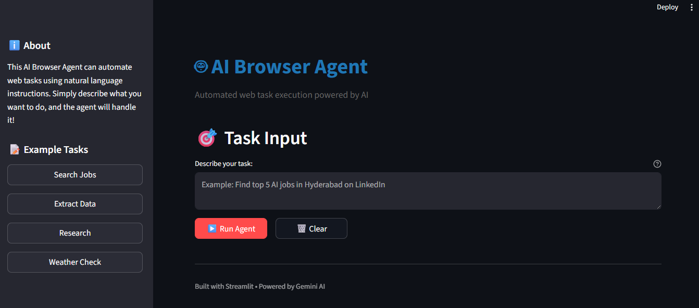

# 🤖 AI Browser Agent

An intelligent **Agentic AI browser automation system** that performs real web tasks autonomously using natural language instructions.

This project combines **LLM reasoning + browser control + autonomous execution** to navigate websites, extract data, fill forms, and complete multi-step workflows like a human user.

---

## 🚀 Demo UI

### Streamlit Web Interface



> Professional interactive interface built using Streamlit for real-time task execution.

---

## ✨ Key Features

### 🧠 Natural Language Commands
Describe tasks in plain English:

```text
Find top 5 AI jobs in Hyderabad on LinkedIn
🌐 Autonomous Browser Navigation

AI decides:

where to click
what to search
how to navigate pages
how to complete tasks
🔄 Multi-Step Workflows

Supports tasks like:

Search → Visit pages → Extract info
Login → Navigate dashboard → Download data
Research → Compare websites → Summarize findings
📝 Form Filling Automation

Automatically fills forms, submits data, and handles workflows.

📊 Data Extraction

Extract:

Product info
Job listings
Prices
Tables
Research data
📋 Execution Logs + History

Tracks each action taken by the agent with transparent logs.

🏗️ Architecture
AI Browser Agent
│
├── LLM Reasoning Engine
├── Browser Control Layer
├── Task Planning System
├── Execution Memory
├── Logging + History
└── Streamlit UI
🛠 Tech Stack
Python
Streamlit
Gemini API
Playwright
Asyncio
Logging
Docker
📂 Project Structure
ai-browser-agent/
│
├── app/
│   ├── agents/
│   │   └── agent.py
│   ├── core/
│   │   └── config.py
│   ├── services/
│   │   └── tasks.py
│   └── utils/
│       └── utils.py
│
├── streamlit_app.py
├── requirements.txt
├── requirements_streamlit.txt
├── Dockerfile
├── README.md
└── .env.example
⚡ Installation
1️⃣ Clone Repo
git clone https://github.com/shivamrustagi03/autonomous-browser-agent.git
cd autonomous-browser-agent
2️⃣ Create Virtual Environment
python -m venv venv
Activate:

Windows

venv\Scripts\activate

Mac/Linux

source venv/bin/activate
3️⃣ Install Dependencies
pip install -r requirements.txt
pip install -r requirements_streamlit.txt
playwright install chromium
4️⃣ Add Environment Variables

Create .env

GEMINI_API_KEY=your_api_key_here
GEMINI_MODEL=gemini-pro
▶️ Run Project
Streamlit UI (Recommended)
streamlit run streamlit_app.py

Then open:

http://localhost:8501
CLI Mode
python -m app.main "Find top 5 AI jobs in Hyderabad"
💡 Example Tasks
Job Search
Find top 5 AI jobs in Hyderabad on LinkedIn
Web Scraping
Go to quotes.toscrape.com and extract first 5 quotes
Research
Research top 3 Python web scraping libraries and compare them
Form Filling
Fill registration form on website using sample details
📸 Screenshots
Home UI

Running Task

Final Results

🐳 Docker Support
Build Image
docker build -t ai-browser-agent .
Run
docker run --rm --env-file .env ai-browser-agent
🎯 Why This Project Matters

This project demonstrates production-level skills in:

✅ Agentic AI
✅ LLM Integration
✅ Autonomous Systems
✅ Python Engineering
✅ Browser Automation
✅ UI Development
✅ Real-world Problem Solving

📈 Resume Impact

Built AI Browser Agent with Streamlit UI enabling autonomous multi-step web task execution using LLM reasoning and browser automation.

🔮 Future Improvements
Multi-agent collaboration
Memory-enabled tasks
CAPTCHA solving
Voice commands
Scheduled automation
Browser screenshot previews
Cloud deployment
👨‍💻 Author

Shivam Rustagi

GitHub: https://github.com/shivamrustagi03
LinkedIn: https://www.linkedin.com/in/shivamrustagi03/
⭐ If You Like This Project

Give it a star and connect with me!
