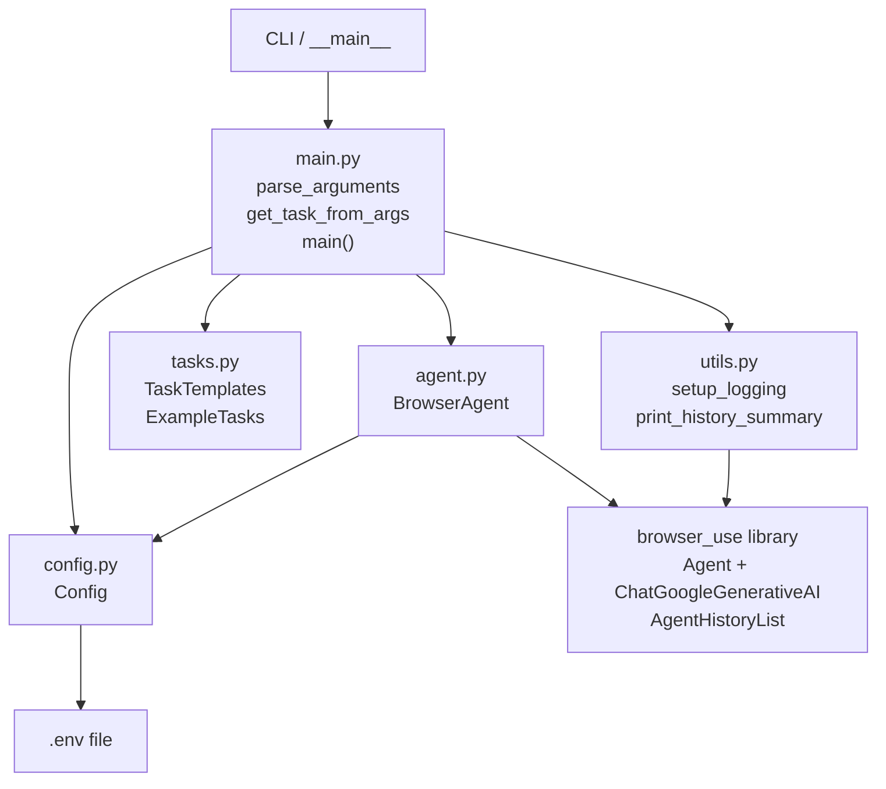

# 🤖 Browser Agent — Interview-Prep Deep Dive

## Project Overview

This project is an **AI-powered browser automation agent**. It wraps the `browser-use` library (itself a Playwright + LLM integration) with a clean Python application shell. You give it a plain-English task (e.g., "Search Google for X and return the top 3 results"), and the Gemini LLM figures out which browser actions to take, clicks things, types, extracts data, and returns a structured history.

---

## Architecture & Dependency Chain



**Call flow (step by step):**

1. User runs `python -m app.main "Search Google for AI"`.
2. **`main.py`** parses CLI args → calls `get_task_from_args()` to resolve the task string.
3. **`main.py`** instantiates `BrowserAgent(model=...)`.
4. **`agent.py` → `BrowserAgent.__init__`** calls `Config.validate()` (reads `.env`), then creates a `ChatGoogleGenerativeAI` LLM handle.
5. **`main.py`** calls `await agent_wrapper.execute(task)`.
6. **`agent.py` → `BrowserAgent.execute`** instantiates `Agent(task, llm)` from `browser_use` and calls `await agent.run()`.
7. The `browser_use` library drives Playwright (real browser), loops: *observe → think (LLM) → act*, returning an `AgentHistoryList`.
8. Back in **`main.py`**, if `--summary` is set, **`utils.py` → `print_history_summary`** is called to pretty-print the run.

---

## File-by-File Breakdown

---

### `app/config.py` — Configuration Management

```python
"""Configuration management for the browser agent."""
import os                        # (1) For reading environment variables
from typing import Optional      # (2) Type hint: value can be str or None
from dotenv import load_dotenv   # (3) Parses .env file into os.environ

load_dotenv()                    # (4) Runs AT MODULE IMPORT TIME — critical!


class Config:
    """Application configuration loaded from environment variables."""

    GEMINI_API_KEY: Optional[str] = os.getenv("GEMINI_API_KEY")   # (5)
    GEMINI_MODEL: str = os.getenv("GEMINI_MODEL", "gemini-pro")   # (6)

    @classmethod
    def validate(cls) -> None:   # (7)
        """Validate that required configuration is present."""
        if not cls.GEMINI_API_KEY:
            raise ValueError(
                "GEMINI_API_KEY is required. Please set it in your .env file."
            )
```

| # | Explanation |
|---|-------------|
| 1 | `os` is the standard library module for environment access. |
| 2 | `Optional[str]` means the type is `str \| None` — the key might not exist. |
| 3 | `python-dotenv` reads key=value pairs from `.env` into `os.environ`. |
| 4 | `load_dotenv()` is a **module-level side effect**. It runs the moment Python imports this file — ensuring env vars are populated before any `os.getenv` calls. |
| 5 | `GEMINI_API_KEY` is a **class variable** (not an instance variable). It is evaluated once when the class body is executed. |
| 6 | `GEMINI_MODEL` has a default fallback of `"gemini-pro"`. |
| 7 | `@classmethod` means `validate()` receives the class itself (`cls`) as its first argument — it can be called as `Config.validate()` without instantiation. |

**Design Pattern: Singleton-like config class**
`Config` is never instantiated. All attributes and methods are class-level, making it effectively a global config namespace — a lightweight Singleton ensuring one source of truth.

---

### `app/agent.py` — Core Agent Wrapper

```python
"""Browser agent implementation."""
import logging
from typing import Optional
from browser_use import Agent, ChatGoogleGenerativeAI, AgentHistoryList  # (1)

from app.config import Config  # (2)

logger = logging.getLogger(__name__)  # (3)


class BrowserAgent:
    """AI-powered browser automation agent."""

    def __init__(
        self,
        model: Optional[str] = None,
        api_key: Optional[str] = None
    ):
        Config.validate()  # (4) Fail-fast validation

        self.model = model or Config.GEMINI_MODEL      # (5)
        self.api_key = api_key or Config.GEMINI_API_KEY

        self.llm = ChatGoogleGenerativeAI(             # (6)
            model=self.model,
            api_key=self.api_key
        )
        logger.info(f"Browser agent initialized with model: {self.model}")

    async def execute(self, task: str) -> AgentHistoryList:
        """Execute a browser automation task."""
        logger.info(f"Executing task: {task[:100]}...")  # (7)

        agent = Agent(task=task, llm=self.llm)            # (8)
        history = await agent.run()                       # (9)

        logger.info("Task execution completed")
        return history
```

| # | Explanation |
|---|-------------|
| 1 | `Agent` = the browser-use agentic loop; `ChatGoogleGenerativeAI` = LangChain-compatible Gemini wrapper; `AgentHistoryList` = typed container for the full run history. |
| 2 | Relative import of `Config` — this project uses the `app` package. |
| 3 | `logging.getLogger(__name__)` creates a logger named `"app.agent"` — the module's dotted path. Allows per-module log filtering. |
| 4 | **Fail-fast validation**: if `GEMINI_API_KEY` is missing, the app crashes here with a clear error before doing any work. |
| 5 | `model or Config.GEMINI_MODEL` — uses the `or` short-circuit: if the caller passed a model name use it, otherwise fall back to config. This is the **Strategy pattern** (the caller can swap the model). |
| 6 | `ChatGoogleGenerativeAI` is a LangChain-compatible wrapper. It does *not* open any network connections yet — it just stores credentials. |
| 7 | `task[:100]` — defensive slicing. Prevents oversized log lines if the task string is very long. |
| 8 | A **fresh `Agent` instance per call**. This means each `execute()` call is stateless — it won't carry over browser state from a previous call. |
| 9 | `await agent.run()` is the heart of the system. Inside `browser_use`, this runs the agentic loop: screenshot → LLM decides action → Playwright executes → repeat. |

**Key design decision:** `BrowserAgent` is a thin wrapper. The heavy lifting is entirely delegated to the `browser_use` library. This is the **Facade Pattern** — it provides a simpler interface (`execute(task)`) over the more complex subsystem.

---

### `app/tasks.py` — Task Templates & Examples

This file contains **no runtime logic** — it is purely data and string-building.

```python
class TaskTemplates:
    """Collection of reusable task definitions."""

    @staticmethod  # (1)
    def basic_search(query: str, top_n: int = 3) -> str:
        return f"Search Google for '{query}' and tell me the top {top_n} results"

    @staticmethod
    def form_filling(url: str, fields: Dict[str, str], submit: bool = True) -> str:
        field_list = "\n".join([f"- {k}: {v}" for k, v in fields.items()])  # (2)
        submit_text = "Then submit the form..." if submit else ""
        return f"""Go to {url} and fill out the form with:\n{field_list}\n{submit_text}"""

    @staticmethod
    def data_extraction(url: str, extraction_instructions: str) -> str:
        return f"""Go to {url} and extract the following information:
{extraction_instructions}
Present the information in a clear, structured format."""

    @staticmethod
    def multi_step_research(
        search_query: str, research_goals: str, output_format: str = "summary"
    ) -> str:
        return f"""I want you to research: {search_query}
Here's what I need:
{research_goals}
Present your findings in a {output_format} format."""


class ExampleTasks:
    """Example task definitions for common use cases."""

    SEARCH_BROWSER_AUTOMATION = (...)  # (3) Pre-built constant strings
    FORM_FILLING_HTTPBIN = "..."
    EXTRACT_QUOTES = "..."
    RESEARCH_PYTHON_SCRAPING = "..."
```

| # | Explanation |
|---|-------------|
| 1 | `@staticmethod` — no `self` or `cls` needed. These are pure functions logically grouped under the class namespace (a Python idiom for namespacing). |
| 2 | `"\n".join([f"- {k}: {v}" ...])` — builds a bulleted list string from a dict. The LLM receives this as formatted natural language instructions. |
| 3 | `ExampleTasks` constants are plain strings. The parentheses on `SEARCH_BROWSER_AUTOMATION = (...)` are just implicit string concatenation — Python merges adjacent string literals. |

**Design Pattern: Template Method / Builder**
`TaskTemplates` is essentially a **query builder for natural language**. Instead of SQL, it constructs structured prompt strings with parameters plugged in.

---

### `app/main.py` — Entrypoint & Orchestration

```python
def parse_arguments() -> argparse.Namespace:        # (1)
    parser = argparse.ArgumentParser(...)
    parser.add_argument("task", nargs="?", ...)     # (2)
    parser.add_argument("--example", choices=[...]) # (3)
    parser.add_argument("--model", default=None)
    parser.add_argument("--verbose", "-v", action="store_true")  # (4)
    parser.add_argument("--summary", action="store_true")
    return parser.parse_args()


def get_task_from_args(args: argparse.Namespace) -> str:
    if args.example:
        examples = {                         # (5) dict lookup as a switch/case
            "search": ExampleTasks.SEARCH_BROWSER_AUTOMATION,
            "form":   ExampleTasks.FORM_FILLING_HTTPBIN,
            "extract": ExampleTasks.EXTRACT_QUOTES,
            "research": ExampleTasks.RESEARCH_PYTHON_SCRAPING,
        }
        return examples[args.example]

    if args.task:
        return args.task

    parser = argparse.ArgumentParser()
    parser.error("Either provide a task description or use --example option")  # (6)


async def main() -> None:
    args = parse_arguments()
    log_level = logging.DEBUG if args.verbose else logging.INFO
    setup_logging(level=log_level)
    logger = logging.getLogger(__name__)

    try:
        task = get_task_from_args(args)
        agent_wrapper = BrowserAgent(model=args.model)
        history = await agent_wrapper.execute(task)

        if args.summary:
            print_history_summary(history)
        else:
            logger.info("Task execution completed successfully")

    except KeyboardInterrupt:          # (7)
        logger.info("Execution interrupted by user")
        sys.exit(1)
    except Exception as e:             # (8)
        logger.error(f"Error during execution: {e}", exc_info=True)
        sys.exit(1)


if __name__ == "__main__":
    asyncio.run(main())                # (9)
```

| # | Explanation |
|---|-------------|
| 1 | `argparse.Namespace` is the typed return of `parse_args()` — a simple object whose attributes are the parsed arg values. |
| 2 | `nargs="?"` means the positional `task` arg is **optional** (0 or 1 values). Without it, argparse would make `task` mandatory. |
| 3 | `choices=[...]` restricts `--example` values to just those strings; argparse auto-rejects anything else with a helpful error. |
| 4 | `action="store_true"` means if the flag is present, the value is `True`; if absent, `False`. No value is read after the flag. |
| 5 | Using a **dict as a switch/case** is idiomatic Python — avoids a chain of `if/elif`. `args.example` is already validated by `choices=`, so a `KeyError` here is impossible. |
| 6 | `parser.error()` prints a usage message and calls `sys.exit(2)`. Creating a new parser just to call `.error()` is a minor code smell (could just raise `SystemExit`), but it works. |
| 7 | `KeyboardInterrupt` is caught **separately** from `Exception`. This is important because `KeyboardInterrupt` doesn't inherit from `Exception` (it inherits from `BaseException`), so it would propagate uncaught through a bare `except Exception` block. |
| 8 | `exc_info=True` tells the logger to include the full traceback in the log output — very useful for debugging. |
| 9 | `asyncio.run(main())` — the standard way to launch an async entry point in Python 3.7+. It creates and manages the event loop lifecycle. |

---

### `app/utils.py` — Logging & History Formatting

```python
def setup_logging(level: int = logging.INFO) -> None:
    logging.basicConfig(
        level=level,
        format="%(asctime)s - %(name)s - %(levelname)s - %(message)s",  # (1)
        datefmt="%Y-%m-%d %H:%M:%S"
    )


def format_history_summary(history: AgentHistoryList) -> Dict[str, Any]:
    return {                            # (2) Data extraction layer
        "urls":                   history.urls(),
        "screenshot_paths":       history.screenshot_paths(),
        "action_names":           history.action_names(),
        "extracted_content":      history.extracted_content(),
        "errors":                 history.errors(),
        "number_of_steps":        history.number_of_steps(),
        "total_duration_seconds": history.total_duration_seconds(),
        "is_done":                history.is_done(),
        "is_successful":          history.is_successful(),
        "has_errors":             history.has_errors(),
        "final_result":           history.final_result(),
    }


def print_history_summary(history: AgentHistoryList) -> None:
    summary = format_history_summary(history)
    logger = logging.getLogger(__name__)
    # ... prints each field with logger.info / logger.warning

    if summary['errors']:
        error_count = sum(1 for e in summary['errors'] if e is not None)  # (3)
        if error_count > 0:
            for i, error in enumerate(summary['errors'], 1):              # (4)
                if error:
                    logger.warning(f"  Step {i}: {error}")
```

| # | Explanation |
|---|-------------|
| 1 | `%(name)s` outputs the logger name (e.g., `app.agent`) — enables you to see which module generated each log line. |
| 2 | `format_history_summary` is a **pure function** that separates data extraction from presentation. This makes it independently testable. |
| 3 | `sum(1 for e in ... if e is not None)` — a generator expression used as a counter. Counts non-None errors efficiently without building an intermediate list. |
| 4 | `enumerate(summary['errors'], 1)` — starts the counter at 1 (not 0) to make step numbers human-readable (`Step 1`, `Step 2`, …). |

---

### Supporting Files

#### `requirements.txt`
```
browser-use>=0.1.0   # Core agentic browser library (Playwright + LLM loop)
playwright>=1.40.0   # Browser automation framework
python-dotenv>=1.0.0 # .env file loading
```
Note: `langchain-google-genai` (which provides `ChatGoogleGenerativeAI`) is a transitive dependency of `browser-use` — not listed explicitly.

#### `.env.example`
Template file committed to Git as a safe reference. The actual `.env` is gitignored to prevent secret leakage.

#### `Dockerfile`
```dockerfile
FROM python:3.11-slim        # Minimal Python base image

RUN apt-get install -y wget gnupg ca-certificates  # (1)

COPY requirements.txt .
RUN pip install --no-cache-dir -r requirements.txt
RUN playwright install chromium --with-deps        # (2)

COPY app/ ./app/
ENV PYTHONUNBUFFERED=1                             # (3)
ENV PYTHONPATH=/app                                # (4)
CMD ["python", "-m", "app.main"]                   # (5)
```

| # | Explanation |
|---|-------------|
| 1 | Playwright needs system certs and `wget` to download browser binaries. |
| 2 | `playwright install chromium --with-deps` downloads Chromium and its OS-level dependencies inside the container. |
| 3 | `PYTHONUNBUFFERED=1` forces stdout/stderr to be unbuffered — Docker logs appear in real-time instead of being swallowed. |
| 4 | `PYTHONPATH=/app` ensures `from app.config import Config` resolves correctly without `pip install -e .`. |
| 5 | `python -m app.main` runs `app/main.py` as a module — this is the standard way to run a package entry point. |

---

## 🎯 Top 3 Tricky/Critical Areas for Interviews

---

### 1. `load_dotenv()` as a Module-Level Side Effect (`config.py`, line 6)

```python
load_dotenv()   # runs the moment this module is imported

class Config:
    GEMINI_API_KEY: Optional[str] = os.getenv("GEMINI_API_KEY")
```

**Why it's tricky:** `load_dotenv()` fires *before* the class body runs. If you moved it *inside* `validate()` or removed it, `GEMINI_API_KEY` would always be `None` in a fresh process, even with a valid `.env` file.

**The catch:** Since `Config.GEMINI_API_KEY` is evaluated at class definition time (once), if you reload `.env` or change environment variables after import, the cached class attribute **never updates**. This is a well-known Python pitfall.

**Interview answer:** *"This is an intentional performance trade-off. Config is loaded once at startup. If you need dynamic re-loading, you'd switch to `@classmethod` properties that call `os.getenv()` lazily."*

---

### 2. `async def execute` + `asyncio.run(main())` — The Async Architecture (`agent.py`, `main.py`)

```python
# agent.py
async def execute(self, task: str) -> AgentHistoryList:
    agent = Agent(task=task, llm=self.llm)
    history = await agent.run()   # browser_use runs async I/O under the hood
    return history

# main.py
asyncio.run(main())   # top-level event loop creation
```

**Why it's tricky:** Playwright and `browser_use`'s Agent loop are both **coroutine-based**. They yield control back to the event loop while waiting for network requests and LLM API calls. If this were synchronous, the entire process would block for seconds per step. `asyncio.run()` creates the event loop, runs `main()` to completion, then tears it down.

**Edge case:** You cannot call `asyncio.run()` from inside an already-running event loop (e.g., from a Jupyter notebook). You'd need `await main()` instead.

**Interview answer:** *"We use async/await to enable concurrency during I/O-heavy operations — the LLM call and browser interactions both involve network I/O. `asyncio.run()` is the entry point idiom for async programs in Python 3.7+."*

---

### 3. `Agent` is instantiated per `execute()` call — No State Persistence (`agent.py`, lines 50-51)

```python
async def execute(self, task: str) -> AgentHistoryList:
    agent = Agent(task=task, llm=self.llm)   # NEW instance every time
    history = await agent.run()
    return history
```

**Why it's tricky:** `BrowserAgent` (the wrapper) is long-lived — it holds the `llm` object. But the inner `browser_use.Agent` is **ephemeral** — a new browser session is launched for each call. This means:
- ✅ **Isolation**: task A's cookies/session don't bleed into task B.
- ❌ **Cost**: no browser reuse. Each call pays the startup penalty (~1-2s).

**Interview justification:** *"For this use case — discrete, independent tasks — stateless execution is the correct default. For a long-lived assistant that needs to stay logged in, you'd refactor to accept a persistent `Agent` instance or pass browser context externally."*

---

## 🛡️ Edge Cases & Error Handling

| Location | Edge Case | How It's Handled |
|---|---|---|
| `config.py` → `validate()` | Missing `GEMINI_API_KEY` | Raises `ValueError` with a clear message before any work is done |
| `main.py` → `main()` | `KeyboardInterrupt` (Ctrl+C) | Caught separately from `Exception`; logs "interrupted" and exits cleanly with code 1 |
| `main.py` → `main()` | Any other unexpected exception | Caught by `except Exception as e`; full traceback logged via `exc_info=True`; exits with code 1 |
| `agent.py` → `execute()` | Very long task string | `task[:100]` slicing prevents log line overflow |
| `utils.py` → `print_history_summary()` | `errors` list contains `None` entries | Filters with `if e is not None` and `if error` before logging |
| `tasks.py` → `form_filling()` | `submit=False` | `submit_text` becomes empty string; no "submit" instruction is included in the prompt |
| `main.py` → `get_task_from_args()` | Neither `--example` nor `task` provided | Calls `parser.error()` which prints usage and exits with code 2 |

---

## Quick Reference: Design Patterns Used

| Pattern | Where | How |
|---|---|---|
| **Facade** | `BrowserAgent` | Hides `browser_use.Agent` + Playwright complexity behind `execute(task)` |
| **Singleton (config namespace)** | `Config` class | Never instantiated; class attributes act as global config state |
| **Strategy** | `BrowserAgent.__init__` | Caller can inject a different `model` to swap LLM strategies |
| **Template Method / Builder** | `TaskTemplates` | Parameterized methods build structured prompt strings |
| **Separation of Concerns** | `utils.py` | `format_history_summary` (data) is separated from `print_history_summary` (presentation) |
